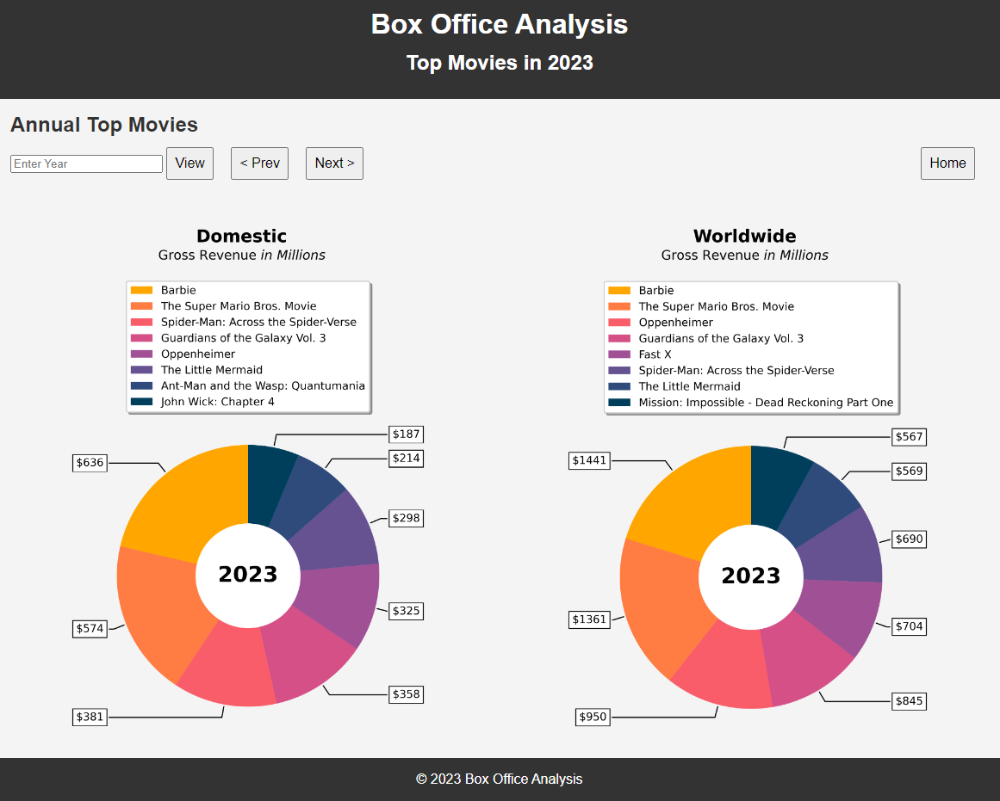

# CS 122 Project: Box Office Analysis Dashboard

## Authors

- Ezra Hsieh
- Tara Parker

## Project Description

Box Office Analysis Dashboard (BOAD) allows users to visualize trends at the box office through an interactive dashboard. BOD is a Python-based web interface to obtain, analyze, and visualize box office data from [Box Office Mojo by IMDB](https://www.boxofficemojo.com/). BOAD allows users to explore the latest and historical box office data and visuazlize temporal trends. BOAD displays timeseries via bar charts for weekly gross box office gross. Futhermore, BOAD allows users explore and compare detailed information about annual top movies by displaying pie charts of the top movies for each year for the domestic and worldwide box office. By combining data collection, storage, and visualization techniques, BOAD aims to streamline the process of accessing and understanding box office trends.

## Project Outline and Plan

### Interface Plan
Your interface can be either a Graphic User Interface (GUI) generated with
Python’s Tkinter library, or a web interface, created with Flask. Your interface
should have at least two windows, such as a home screen and a pop-up window.
Your interface must have at least 4 widgets such as buttons, drop-down windows,
or otherwise that allow the user to gather, update, and interact with the data

Box Office Analysis displays data with a web interface, created with Flask. Our interface presents a weekly gross revenue timeseries as a bar chart, as well as a pie chart to compare the annual top 8 domestic and worldwide movies. User can navigate the years and update data with widgets.
#### Windows
1. Home screen with timeseries bar chart of gross revenue by week.
2. Two pie charts of top 8 movies (domestic and worldwide), by annual gross, for the queried year.  
#### Widgets
1. A drop-down menu to change the year of data shown on window 1.
2. A go button to reload/update the data shown on window 1.
3. A next button to show the next year and a previous button to show the bar chart for the previous year.
4. An entry widget (at the bottom of window 1) to open window 2 that displays pie charts for the entered year.
5. An entry widget to display pie charts for a given year.
6. A next button to show the next year and a previous button to show the previous year pie charts.
7. A home button that returns the user to Window 1

### Access Web Data
Application uses Requests and Beautiful soup to gather data from [Box Office Mojo Domestic Box Office Weeklies](https://www.boxofficemojo.com/weekly/).

### Data Organization 
Scraped data from Box Office Mojo is stored using Pandas dataframes and CSV files. The scraped data is first put into a Pandas dataframe and cleaned. The domestic weekly data is stored in CSV files for the bar charts and top 8 movie data is passed directly to the plotting function to create PNG files. Bar and pie charts are stored locally as png files. 

Example of data from Box Office Mojo. 
| Rank (This week) | LW  | Release                | Gross       | %± LW  | Theaters | Change | Average | Total Gross | Weeks | Distributor        |
| ---------------- | --- | ---------------------- | ----------- | ------ | -------- | ------ | ------- | ----------- | ----- | ------------------ |
| 2                | 1   | The Exorcist: Believer | $14,675,000 | -56.7% | 3,684    | +21    | $3,983  | $48,601,950 | 2     | Universal Pictures |
|                  |     |                        |             |        |          |        |         |             |       |                    |

### Data Analysis and Visualization Plan

Box Office Analysis utilizes matplotlib to create bar and pie charts for depicting the trends in weekly domestic box office gross over time and comparing annual domestic and worldwide top movies.
Window 1 visualizes weekly gross trends of weekly box office data with bar chart timeseries. Window 2 uses side-by-side pie charts to vizualize and compare the domestic and worldwide top 8 movies for a given year. 
